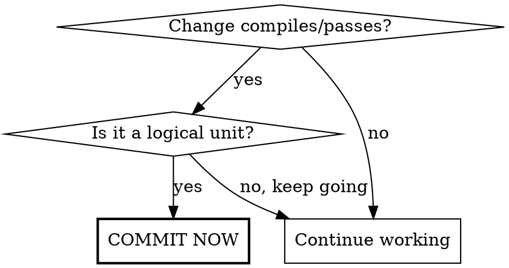

# Git Workflow

## The Rule

**Commit after every logical unit of work.** Not at the end of a session. Not when the user asks. After EACH completed change.



**Logical unit = one of:**
- Single feature or enhancement
- Single bugfix
- Single refactor
- Documentation update
- Test addition

If you need "and" in your commit message, split into multiple commits.

## Commit Format

```
<type>(<scope>): <description>

[body - the WHY for non-trivial changes]
```

**Types:** feat, fix, docs, style, refactor, perf, test, chore

**Scopes:** ui, serial, parser, config, plot, log (or as defined in project)

**Examples:**
```
feat(ui): add contactor control panel
fix(serial): handle CR+space line endings
refactor(parser): extract voltage parsing to module
```

## The Why (Commit Body)

| Change Type | Body Required? | Format |
|-------------|----------------|--------|
| Typo, formatting | No | - |
| Simple bugfix | Brief | 1-2 sentences |
| Feature with decision | Yes | Structured |
| Architecture change | Yes | Detailed structured |

**Structured template:**
```
What: Brief description

Reasoning:
- Problem: What was the actual problem?
- Considered: What alternatives?
- Rejected: What was discarded and why?
- Decision: Chosen solution and justification
```

## Red Flags - STOP and Commit

You're rationalizing if you think:

| Thought | Reality |
|---------|---------|
| "I'll commit when I'm done" | You ARE done with this unit. Commit now. |
| "Let me just add one more thing" | That's a separate commit. Commit first. |
| "It's not complete yet" | Is THIS change complete? Commit it. |
| "I'll batch these together" | Atomic commits. Commit separately. |
| "The user didn't ask me to commit" | You don't need permission. Commit. |
| "I want to test more first" | Does it compile? Tests pass? Commit. |

## Commit Checklist

Before each commit:
1. **Atomic?** - One logical change only
2. **Type correct?** - feat/fix/refactor/etc.
3. **Scope correct?** - ui/serial/parser/etc.
4. **Message clear?** - Describes the change
5. **Why documented?** - For non-trivial changes

## HEREDOC Format

Always use HEREDOC for commit messages to preserve formatting:

```bash
git commit -m "$(cat <<'EOF'
feat(ui): add dashboard tab

What: New dashboard tab showing BMS overview

Reasoning:
- Problem: No quick overview of system state
- Decision: Grid layout with key metrics
EOF
)"
```
